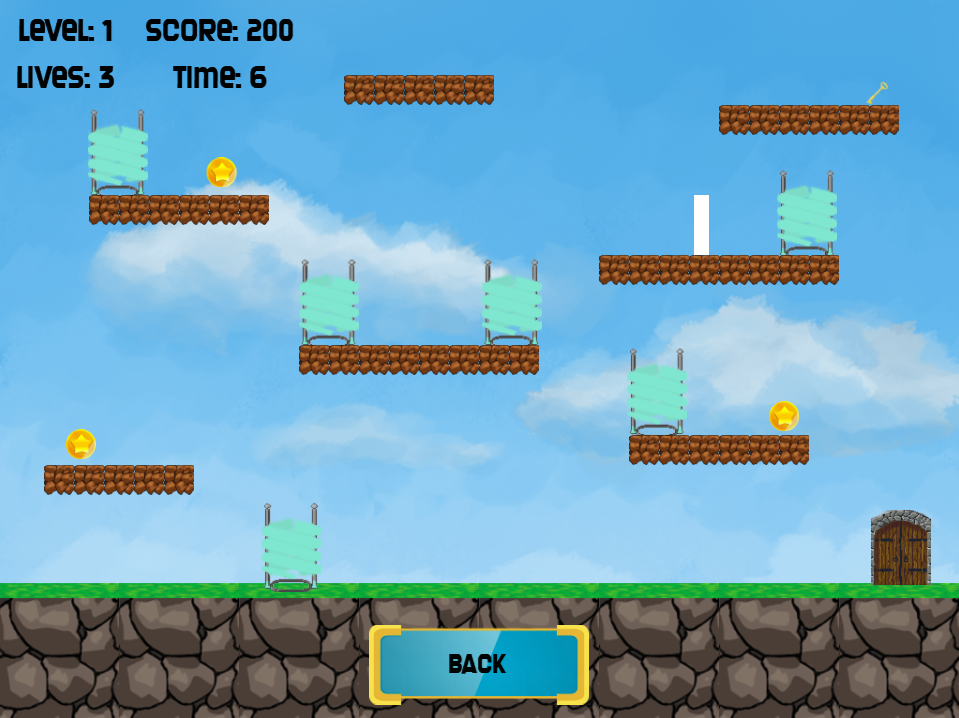
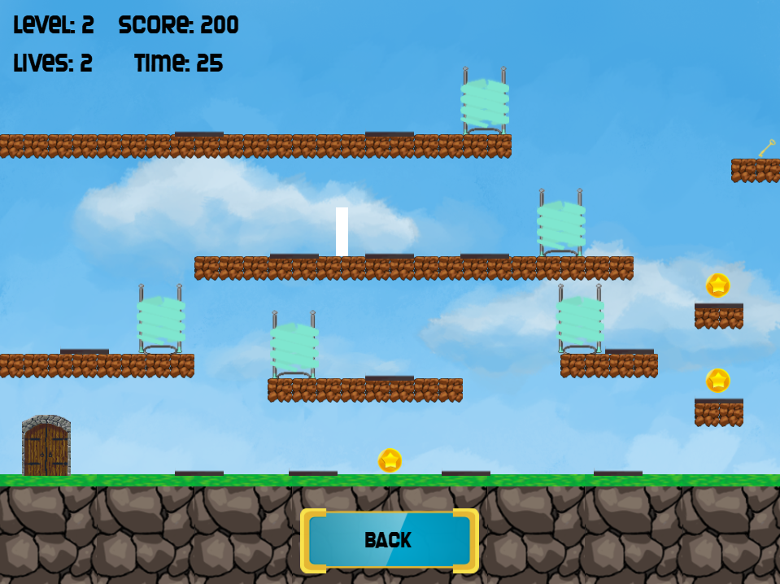
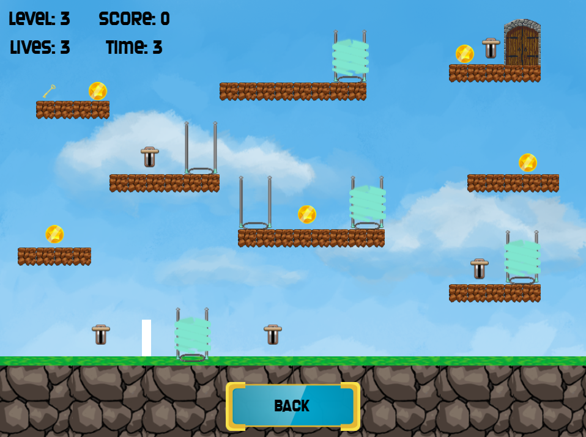

# Platformer-Solar2D
A simple logic game (that's kinda a platformer) made in Solar2D

### About
-------------
This is one of my favorite games that I've made in Solar2D. It features three levels, each with different mechanics.  
The game is more of a showcase (or a demo) rather than a full product. Nonetheless, I've never finished it, but what I have isn' too bad anyway. 
Your goal in this game is to find a key and exit the level. Sounds simple, but the logic puzzles and lack of jumping will force you to stop and think a bit  

This is more of a preserving repo. It's always fun to look back at older projects and think about how I would approach them now.  
If you want to improve upon this code and finish the game, feel free to do so :)

### Getting Started
-------------
To run this project, you will need the latest version of Solar2D (https://docs.coronalabs.com/guide/start/installWin/index.html).   
To build the game, use this guide (https://docs.coronalabs.com/guide/distribution/win32Build/index.html)  
You're free to modify the project as you wish.

### Preview
-------------

